

<picture>
  <source media="(prefers-color-scheme: dark)" srcset="assets/hero-dark.png">
  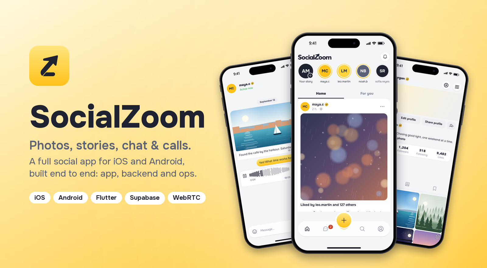
</picture>

 

**A full social app for iOS and Android: feed, stories, messaging and voice calls, 
on a self-hosted backend I designed, built and deployed.**

 

 

[Screens](#screens) · [Features](#features) · [Architecture](#architecture) · [Engineering](#engineering-highlights) · [Tech stack](#tech-stack) · [Quality](#quality)

 

## Overview

SocialZoom is an Instagram-style social app: a photo and video feed, 24-hour stories,
one-to-one and group messaging, voice notes and voice calls, with the moderation and
privacy tooling a real community needs. I built it as a freelance engagement for the
client **Social Zoom**, from June to September 2026.

It is one engineer's work across the whole stack: the Flutter app, a self-hosted Supabase
backend with its PostgreSQL schema and security rules, the realtime and push pipelines,
a call relay, a media transcoder, an admin panel, and the servers they all run on.

> [!NOTE]
> **This repository is a case study.** SocialZoom is the client's commercial product and its
> source code is private. What is here is the product, its architecture, and the engineering
> behind it. Every screen below is rendered from the app's real widgets by its own test suite,
> with invented people and painted photos, so no real account appears.

 

| **962** | **160k+** | **22** | **97** | **3,418** | **1,150** |
|:---:|:---:|:---:|:---:|:---:|:---:|
| Dart files | lines of Dart | modular packages | database migrations | tests passing | localised strings |

 

## Screens

Every screen in both themes, **light on the left and dark on the right**. Dark mode is a
real second theme, chosen in *Settings › Appearance*: Sunshine yellow on a deep blue-violet
rather than black, so the app still looks like itself.

<table>
<tr>
<td width="56%">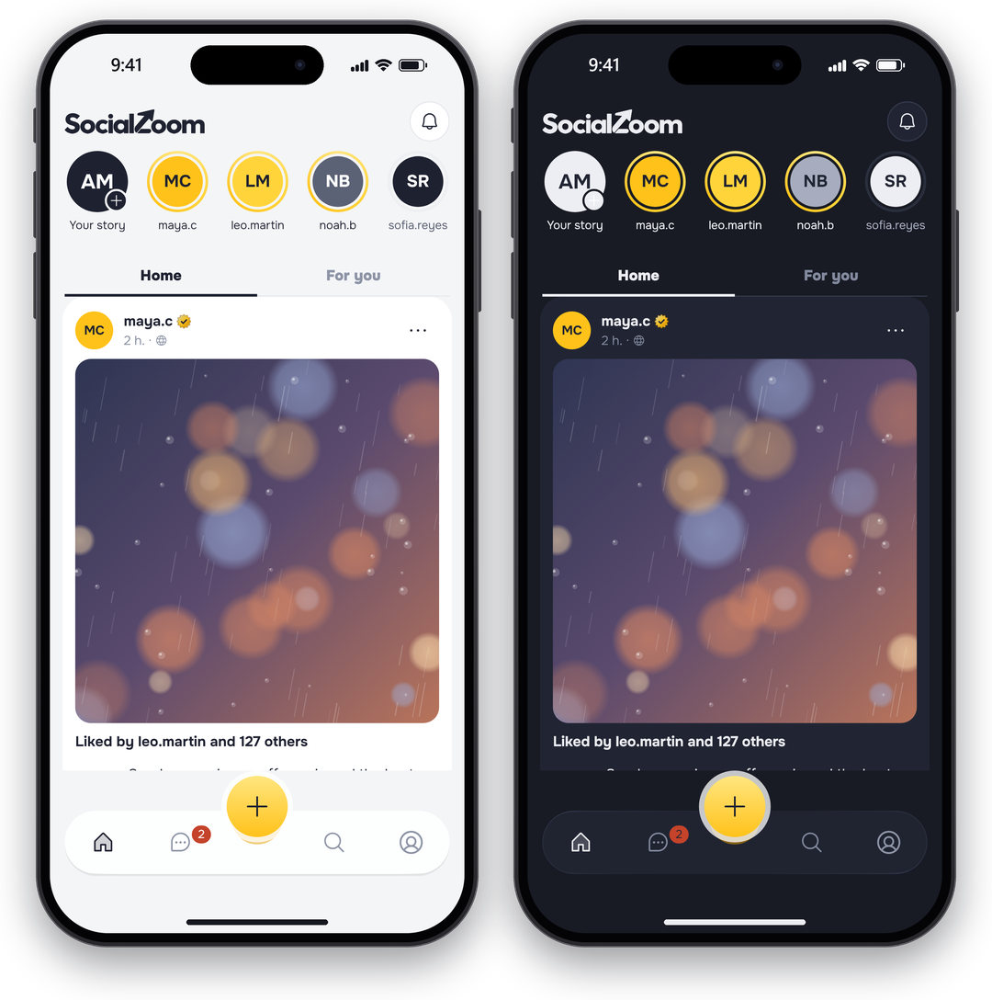</td>
<td>
<h3>Home feed</h3>
Stories across the top, then posts from the people you follow, with <b>Home</b> and
<b>For you</b> tabs. The floating tab bar keeps the <b>+</b> for posting one thumb away.
  
Feed · Stories tray · Likes, comments, share · Tab bar with raised +
</td>
</tr>
<tr>
<td>
<h3>Profile</h3>
A cover, the counts that matter (posts, followers, following, total likes), and a grid of
posts with Tagged and Saved beside it. The yellow tick marks verified accounts.
  
Profile grid · Verified tick · Edit and share profile · QR profile card
</td>
<td width="56%">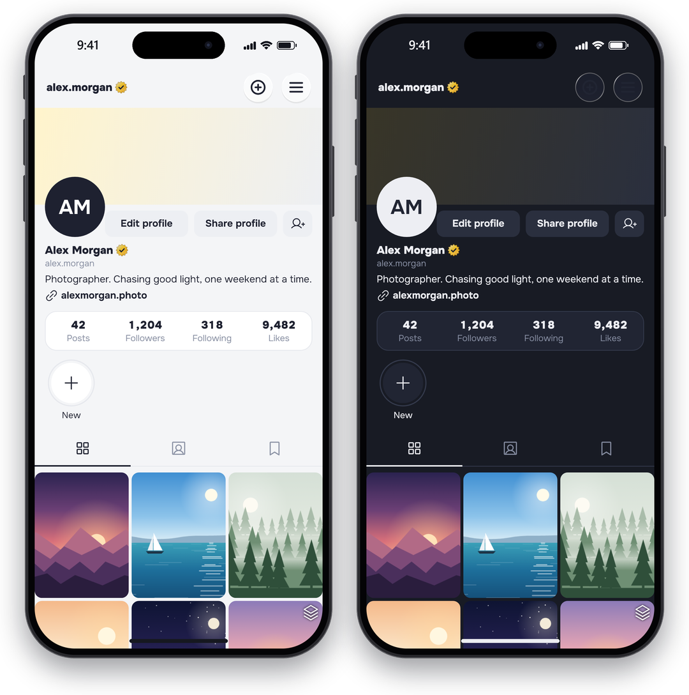</td>
</tr>
<tr>
<td width="56%">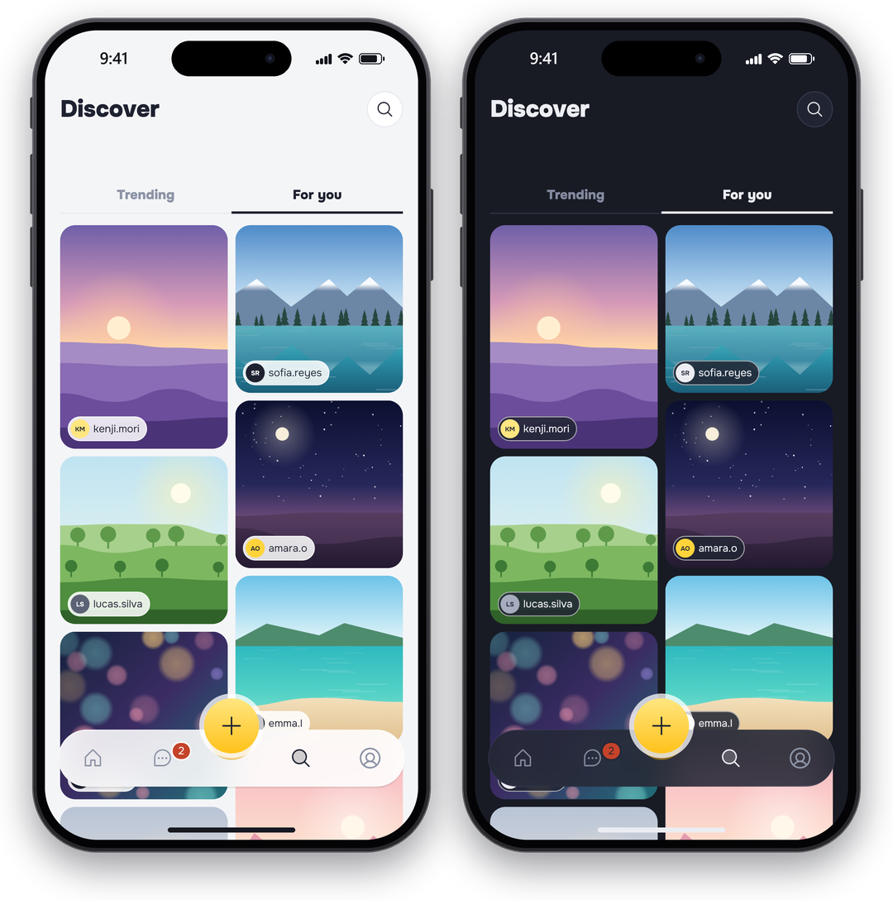</td>
<td>
<h3>Discover</h3>
<b>Trending</b> and a personal <b>For you</b>, laid out as a staggered grid of photos and
videos, shaped by the topics chosen at sign-up.
  
Trending · For you · Topics · Search
</td>
</tr>
<tr>
<td>
<h3>Chats</h3>
Every conversation, with unread counts, pinned chats and a separate tab for message
requests from people you do not follow.
  
Inbox · Requests · Pinned · Online presence
</td>
<td width="56%">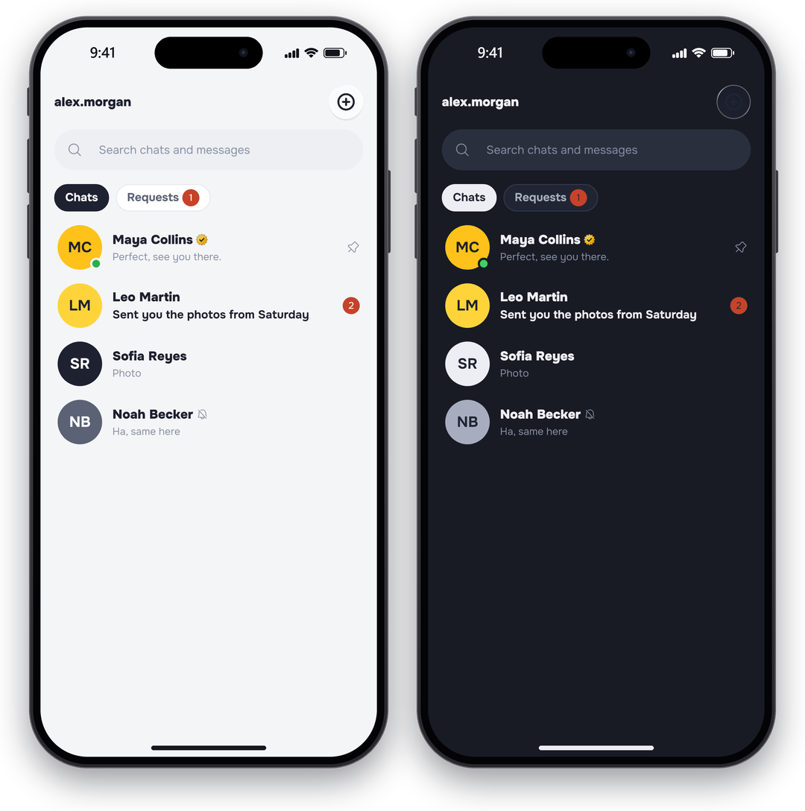</td>
</tr>
<tr>
<td width="56%">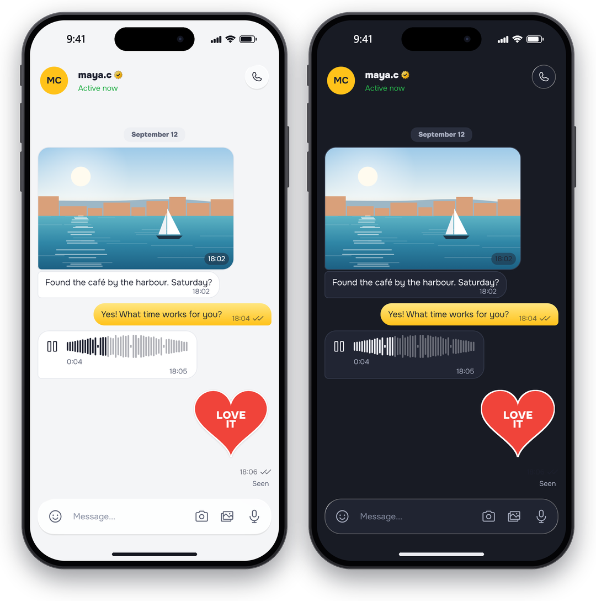</td>
<td>
<h3>Messaging</h3>
Photos you can draw on before sending, videos with a full player, voice notes with a
live waveform, GIFs and stickers, reactions, replies and read receipts.
  
Photo markup · Video player · Voice notes · Stickers · Reactions
</td>
</tr>
<tr>
<td>
<h3>Group chats</h3>
Named groups with each sender labelled, the same media as one-to-one chats, and member
management for the people who run them.
  
Groups · Members · Shared media
</td>
<td width="56%">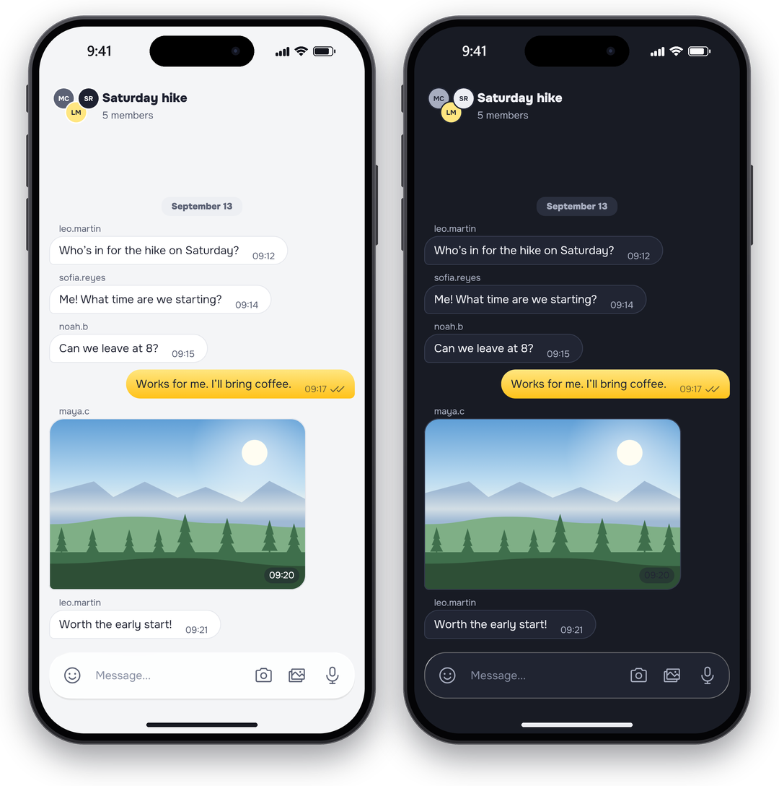</td>
</tr>
<tr>
<td width="56%">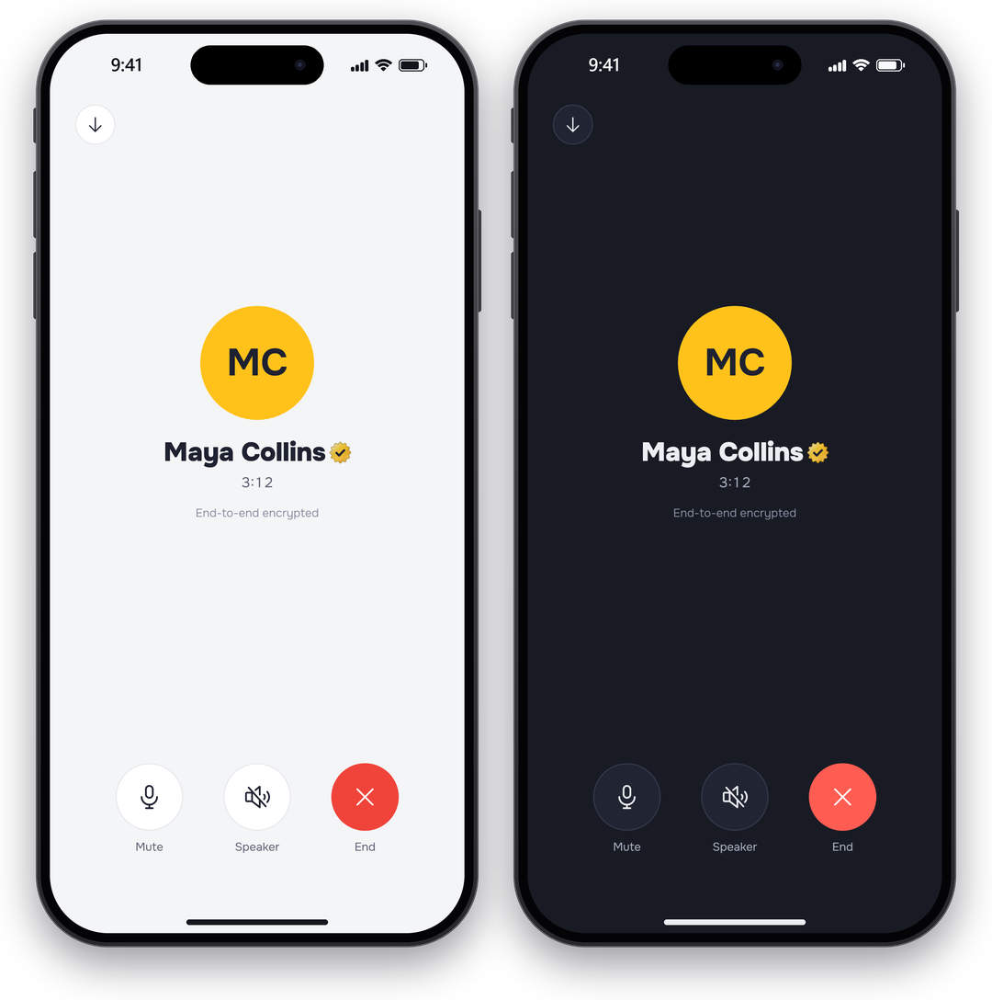</td>
<td>
<h3>Voice calls</h3>
End-to-end encrypted calls that ring like phone calls: CallKit on iPhone, a full-screen
ringer on Android, and they keep going when you leave the app.
  
WebRTC · TURN relay · CallKit · PushKit · Background calls
</td>
</tr>
<tr>
<td>
<h3>Stories</h3>
Twenty-four-hour stories with a progress bar per slide, quick emoji reactions and a reply
field that opens the chat. An editor for drawing, text and stickers.
  
Stories · Reactions · Replies · Editor · Highlights
</td>
<td width="56%">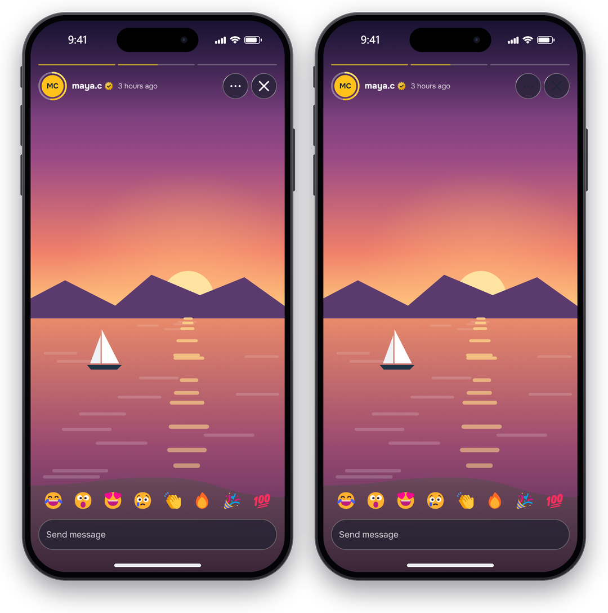</td>
</tr>
<tr>
<td width="56%">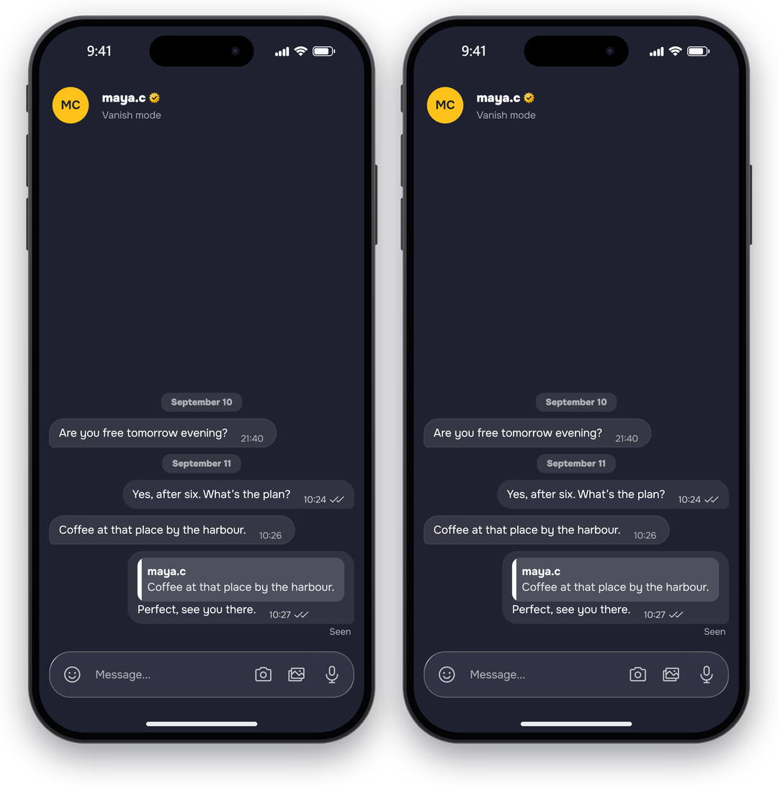</td>
<td>
<h3>Vanish mode</h3>
Messages that disappear once they have been seen and the chat is closed, in a chat that
turns dark to say so, with a warning if the other person takes a screenshot. It is dark in
<i>both</i> themes, which is why the two phones match.
  
Disappearing messages · Screenshot alerts
</td>
</tr>
<tr>
<td>
<h3>Privacy and control</h3>
Private accounts, activity status, blocking, hidden words, app lock, and a record of every
report you have made and what was done about it. Theme lives here too.
  
Private account · Block · Hidden words · App lock · Your reports
</td>
<td width="56%">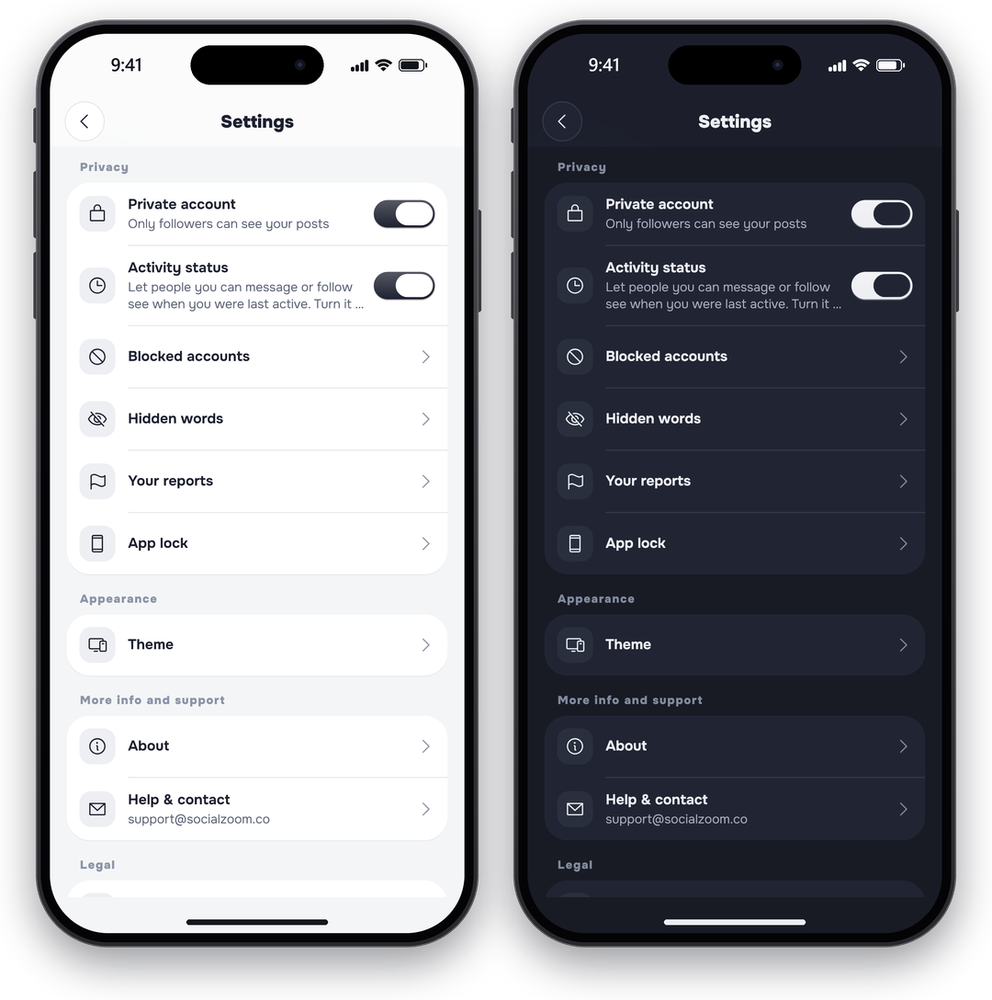</td>
</tr>
</table>

 

## Features

<table>
<tr>
<td valign="top" width="50%">

**Social**
- Feed with **Home** and **For you**, and a stories tray
- Photo and video posts, likes, comments, shares, saves
- Profiles with covers, verified ticks and a QR profile card
- Follow requests, private accounts, a following cap
- Discover with Trending and For you, topics at sign-up
- Referrals and multiple accounts on one phone

**Stories**
- 24-hour stories with viewers, reactions and replies
- An editor for drawing, text and stickers
- Mentions, highlights and an archive

</td>
<td valign="top" width="50%">

**Messaging and calls**
- One-to-one and group chats, message requests
- Photo markup, a full video player, save to gallery
- Voice notes with waveforms, GIFs, stickers
- Reactions, replies, unsend, pins, mutes
- Vanish mode with screenshot alerts
- Voice calls with CallKit and PushKit

**Safety and platform**
- Reports with outcome notices, and a *Your reports* screen
- Block, hidden words, app lock with Face ID
- Account deletion and data export
- A moderation admin panel
- Light and dark themes, offline-first sync

</td>
</tr>
</table>

 

## Architecture

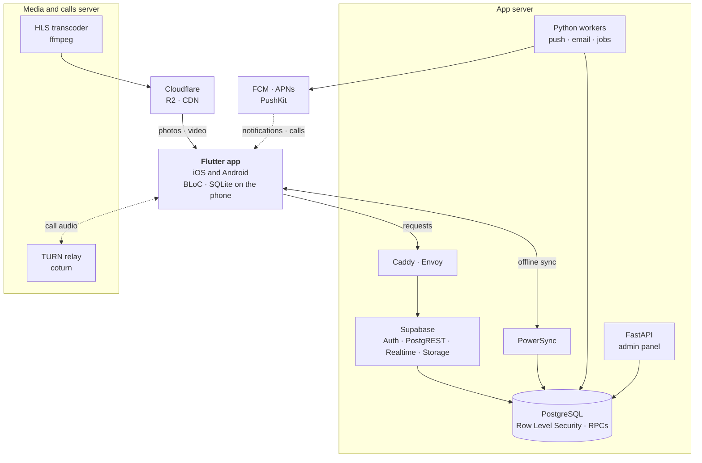
```mermaid
flowchart TB
    app["<b>Flutter app</b><br/>iOS and Android<br/>BLoC · SQLite on the phone"]

    subgraph appserver["App server"]
        direction TB
        gw["Caddy · Envoy"]
        supa["Supabase<br/>Auth · PostgREST · Realtime · Storage"]
        ps["PowerSync"]
        pg[("PostgreSQL<br/>Row Level Security · RPCs")]
        jobs["Python workers<br/>push · email · jobs"]
        admin["FastAPI<br/>admin panel"]
        gw --> supa --> pg
        ps --> pg
        jobs --> pg
        admin --> pg
    end

    subgraph mediaserver["Media and calls server"]
        direction TB
        turn["TURN relay<br/>coturn"]
        hls["HLS transcoder<br/>ffmpeg"]
    end

    cdn["Cloudflare<br/>R2 · CDN"]
    push["FCM · APNs<br/>PushKit"]

    app -- "requests" --> gw
    app <-- "offline sync" --> ps
    app <-. "call audio" .-> turn
    hls --> cdn
    cdn -- "photos · video" --> app
    jobs --> push
    push -. "notifications · calls" .-> app
```

The app reads from a copy of the data on the phone and writes through the server, so every
screen opens instantly and keeps working on a bad connection. Security is enforced in
PostgreSQL itself, not in the app. Calls and video transcoding run on a second server,
each capped so that neither can starve the other.

 

## Engineering highlights

<b>Offline first, and honest about it</b>

 

Every screen reads from SQLite on the phone, kept in step with PostgreSQL by PowerSync, so
opening the app never waits on the network. The hard part is noticing when that sync has
quietly died. The app reconnects when it returns to the foreground, runs a watchdog that
backs off, and treats an upload the server never answers as proof the stream is dead:
within 30 seconds rather than 90. A small *Catching up…* bar says so while it recovers.

<b>Security lives in the database</b>

 

Row Level Security on every table, and every write that matters goes through a
security-definer function that checks who is asking. An audit of the messaging tables found
four holes before launch: messages readable without signing in, a sender that could be
forged, conversations anyone could join, and conversations anyone could delete. All four
are closed, and the migrations ship with SQL check scripts that prove it.

<b>Calls that ring like phone calls</b>

 

WebRTC over my own TURN relay, so calls connect even when both phones sit behind carrier
NAT. On iPhone, an incoming call arrives as a PushKit VoIP push and is handed to CallKit,
so it rings on the lock screen like any other call; on Android it is a full-screen ringer.
Calls keep going when you leave the app, and a call answered on the system's own screen
is picked up by the app without a second tap.

<b>Push notifications that behave</b>

 

Each message gets its own collapse key, so a burst of five messages arrives as five
notifications instead of silently collapsing into one; on iPhone they stack together under
the app. Tapping one opens the exact post, comment or chat it is about, including a like
on a comment, which needs the post looked up first.

<b>Media that holds up</b>

 

Photos are resized into full, feed and thumbnail sizes on the phone, and video is
compressed down a ladder (1080p for short clips, stepping down for longer ones) before it
uploads. On the server, an ffmpeg worker cuts each video into an adaptive HLS ladder so it
plays smoothly on any connection. That worker shares a machine with the call relay, so it
runs under hard CPU and memory limits: a transcode can never make a call stutter.

<b>Two themes from one design system</b>

 

Dark mode meant moving about 1,900 colour references from compile-time constants to a
theme-aware palette, across 22 packages, while leaving the light theme exactly as it was,
checked by re-rendering every light screen afterwards. Every dark colour is
asserted by value in a test against the approved design, contrast is measured in tests
too, and the glass the tab bar sits on has two different "darks": a light lift over the
page, and a dense pad that keeps icons readable over any photo.

<b>A moderation loop that closes</b>

 

Reports from any post, comment, story, message or profile land in a FastAPI admin panel.
When a moderator acts, the person who reported it is told what happened, and can look back
at every report they have made in <i>Settings › Your reports</i>.

 

## Tech stack

| Layer | Built with |
|---|---|
| **App** | Flutter, Dart, BLoC and Cubit, go_router, a component library, 22 local packages |
| **On the phone** | PowerSync (PostgreSQL to SQLite), secure storage, Face ID and fingerprint unlock |
| **Backend** | Self-hosted Supabase: PostgreSQL, PostgREST, GoTrue auth, Realtime, Storage |
| **Database** | 97 migrations, Row Level Security, PL/pgSQL functions, 78 SQL check scripts |
| **Calls** | WebRTC, a coturn TURN relay, CallKit and PushKit on iOS, full-screen intents on Android |
| **Notifications** | Firebase Cloud Messaging, APNs, PushKit, per-message collapse keys |
| **Media** | On-device compression, ffmpeg HLS transcoding, Cloudflare R2 and CDN |
| **Server side** | Python workers, a FastAPI admin panel, Caddy, Envoy, Docker, systemd |
| **Delivery** | Codemagic for signed iOS builds, App Store Connect API, Google Play Console |

 

## Quality

- **3,418 tests** across unit, widget and golden tests.
- **Golden screenshots.** The screens on this page are rendered by the test suite from the
  real widgets at iPhone 15 Pro size, then framed here, so they cannot drift from the app.
- **Contrast in tests.** Every dark-theme colour pair that carries text is measured against
  WCAG AA, and the few that fall short are recorded by value rather than hidden.
- **Migrations are checked.** 78 SQL check scripts prove what the migrations changed and
  that they changed nothing else.

 

---

**Chandan Verma** · Software Engineer

Built for **Social Zoom** as freelance work, June to September 2026. 
SocialZoom and its artwork belong to Social Zoom. The source code is private.

 

